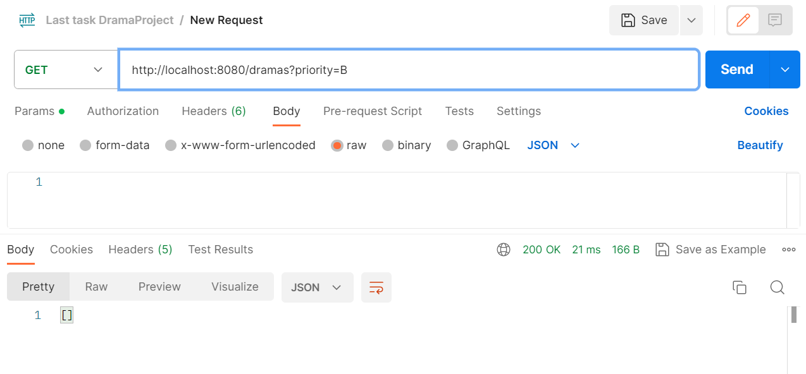
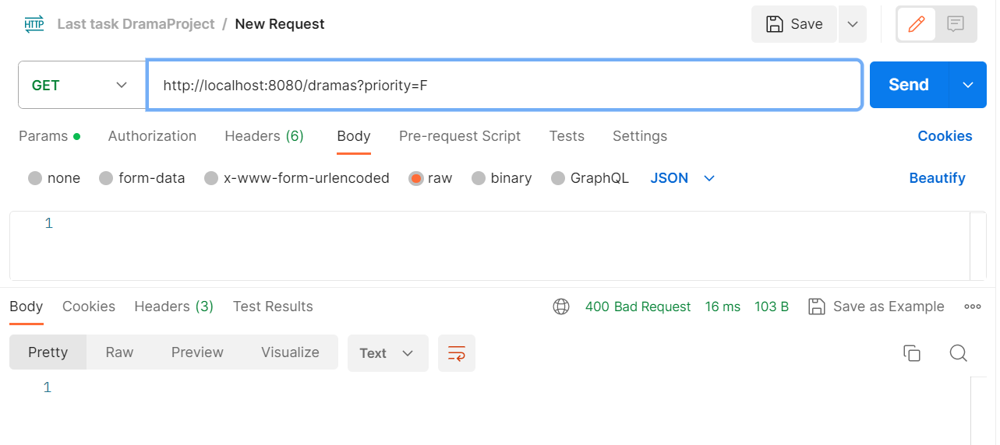
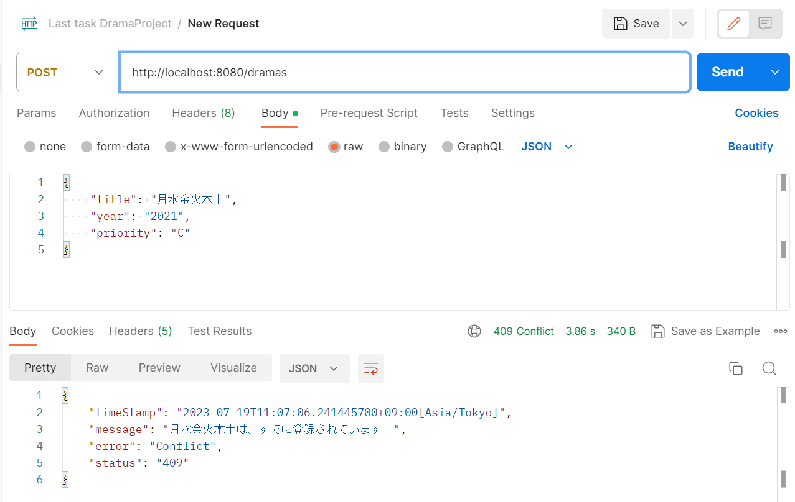
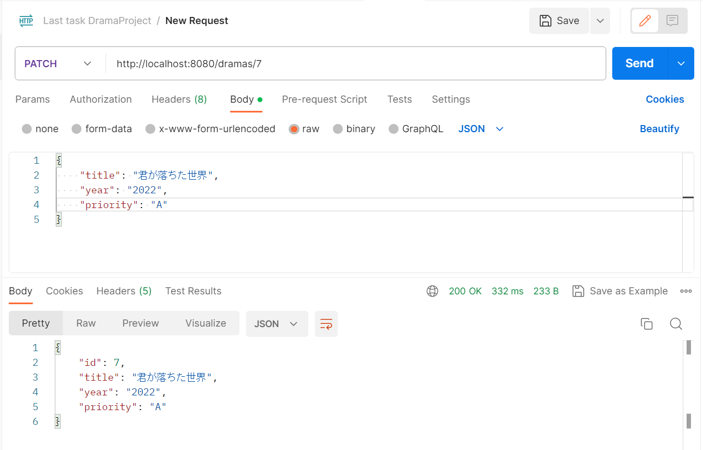
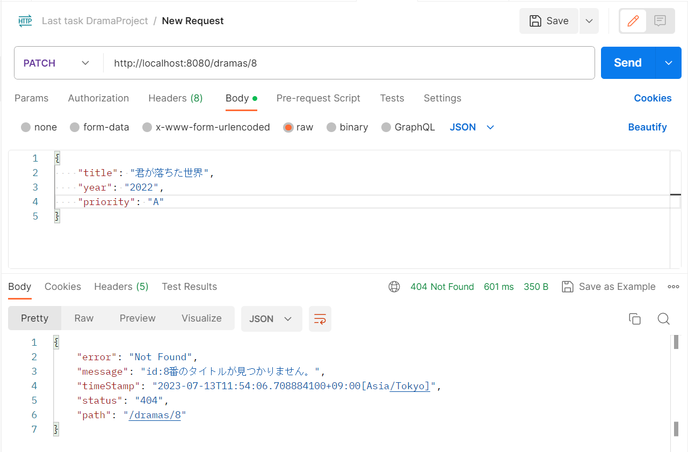
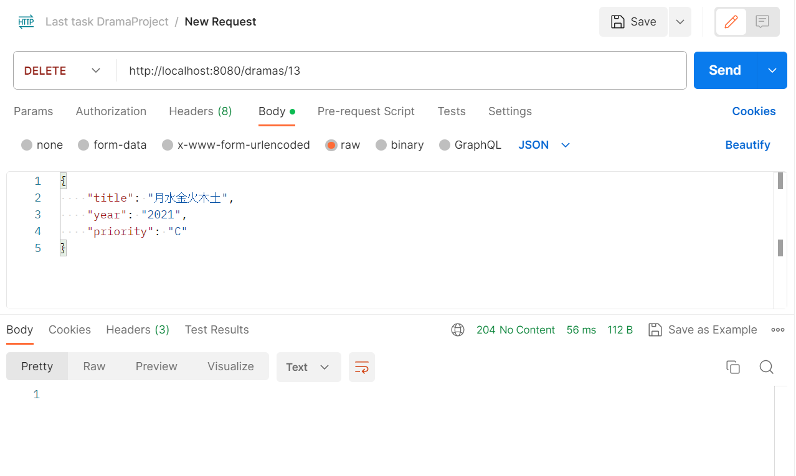
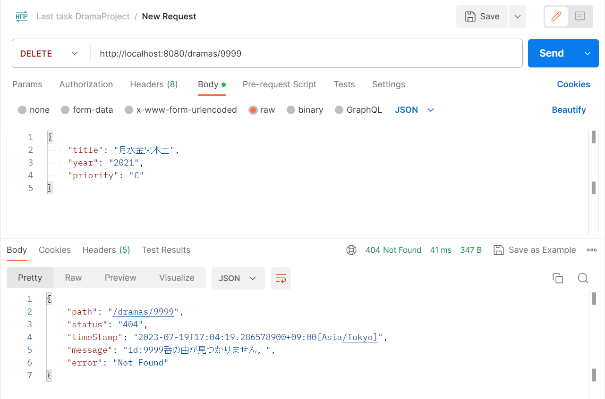

# Dramaメモアプリ
RaiseTech 22年06月度 最終課題Spring Boot RestAPIのCRUDアプリケーション

---
## 概要
見たいドラマを忘れないよう、メモしておけるCRUDアプリです。  
READ・CREATE・UPDATE・DELETE機能を実装。  
単体テスト、結合テスト、GitHub ActionsでのCIも実装予定。

---
## 構成要件
* Java 17
* Spring Boot 3.1.0
* （JUnit 5.8.2）※使用予定
* MySQL 8.0.33
* Docker 20.10.21
* （JUnit 5）※使用予定
* （Mockito）※使用予定

---
## 機能一覧

| 機能 | 詳細 | URL |
| ------------ | ------------- | ------------- |
| 全件取得 | ドラマ一覧を返す | /drama |
| 絞り込み検索 | priorityカラムの｛A、B、C｝を指定して検索 | /drama?priority=○○ |
| 新規登録 | 新しいタイトルを登録する | /drama |
| リストの編集 | 指定したidの内容を変更する | /drama/{id} |
| 削除 | 指定したidのデータを削除する | /drama/{id} |

---

## DBテーブル
テーブル名：drama  

| カラム名 | データ型 | NotNull | キー | 備考 |
| ------------ | ------------- | ------------- | ------------- | ------------- |
| id | int | NOT NULL | 主キー | ID、自動生成 |
| title | VARCHAR(100) | NOT NULL | ユニーク | 見たいドラマのタイトル |
| year | VARCHAR(100)  ||| 発表年 |
| priority | VARCHAR(1) | NOT NULL || A>B>Cの順で優先順位が高いとする |

---

## 実行結果

<h4> 1-1. GET /drama 一覧表示 </h4>

<h4> 1-2. GET /drama?priority=○ 優先度で絞り込み </h4>

<h4> 1-3. GETの例外・エラー処理  </h4>

<h4>1-3-1. /drama?priority=○ priorityに指定したドラマがDBに存在しないとき</h4>

<h4>1-3-2．/drama?priority=○ priorityにABC以外のものを指定したとき</h4>

<h4> 2-1. POST /drama 新規登録</h4>

<h5>ResponseBody</h5>

<h5>ResponseHeader</h5>

<h4> 2-2. POSTの例外・エラー処理</h4>

<h4>2-2-1．/drama バリデーションエラーのとき</h4>

<h4>2-2-2．/drama リクエストしたドラマのタイトルがすでに登録されているとき</h4>

<h4> 3-1. PATCH /drama/{id} 更新</h4>

<h4> 3-2. PATCHの例外・エラー処理</h4>

<h4> 3-2-1. PATCH /drama/{id} 指定したidにデータがないとき</h4>

<h4> 3-2-2. PATCH /drama/{id} 更新したタイトルがすでにDBに登録されているとき</h4>

<h4>4-1. DELETE /drama/{id} 削除</h4>

<h4>4-2. DELETEの例外・エラー処理</h4>

<h4>4-2-1. /drama/{id} 指定したidにデータがないとき</h4>

